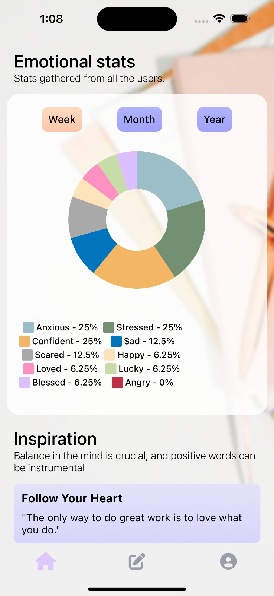
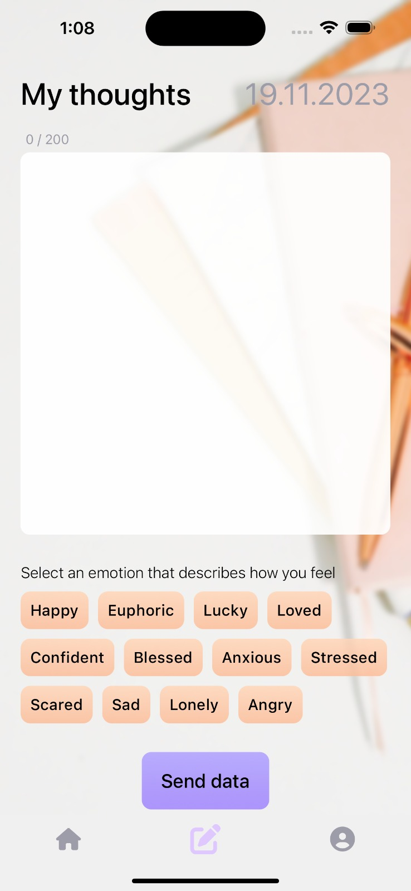
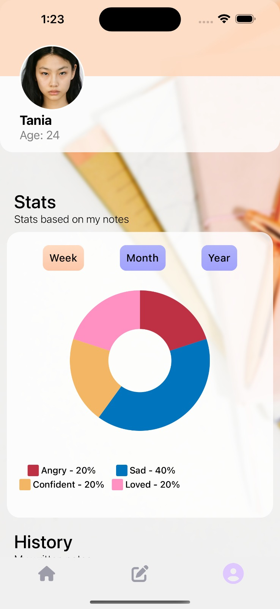
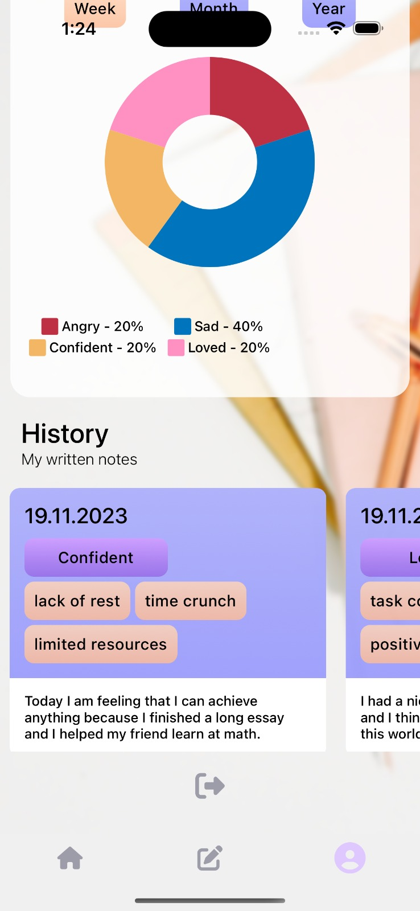
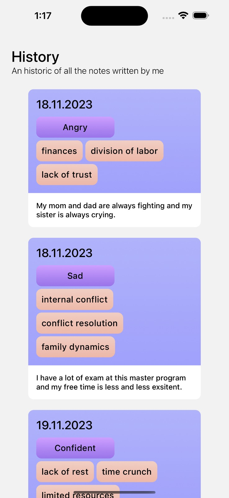

# 🧠✨ HealthyMind ✨🧠

> ✨ Our journey began with a simple yet profound realization: the importance of understanding and managing our emotions for overall well-being. In essence, HealthyMind is a product of a genuine desire to make a difference. It emerged from the belief that everyone deserves a tool that not only allows them to express their feelings but also helps them understand and manage their emotions in a positive and empowering way.

# Home

 > ✨ The home screen welcomes users with comprehensive app statistics showcasing the most frequently experienced emotions. Additionally, users can immerse themselves in inspirational quotes and even generate new ones at their convenience.

> ✨ The quotes are automatically generated by AI, similar to the method used for our entire analysis. Users can enjoy AI-generated inspirational quotes alongside our comprehensive analytical insights

  

# Add your thoughts

> ✨ The 'Add Your Thoughts' screen offers users a seamless platform to express their thoughts and emotions conveniently. Once a user completes their input, the content is directed to the AI for analysis, enabling a deeper understanding of their sentiments and insights

  

# Profile & See your thoughts

> ✨ The profile screen displays individual statistics and grants access to the user's history of notes, providing a comprehensive overview of their personal insights and progress within the app.

  
  
  

### Team members & their doing:

> - Pop Iulian: Firebase integrations & React-Native Development
> - Andra Malaescu: React-Native Development, Tester & Design 
> - Andreea Hentes: React-Native Development & UI/UX Design
> - Cosmin Trifu: React-Native Development
> - Poenaru Iulian: React-Native Development, Firebase integrations & Coordinator
